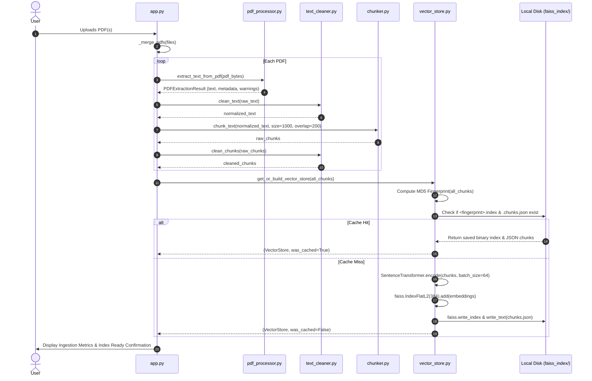
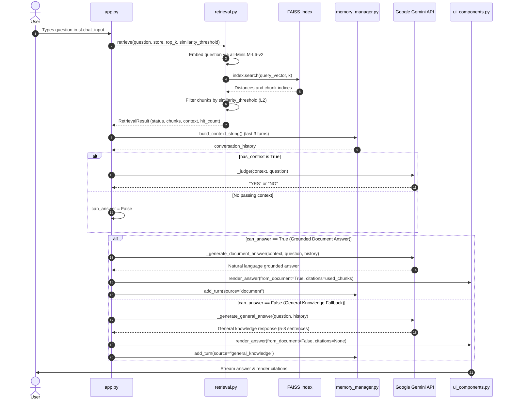

# System Architecture & Flow: Hybrid RAG PDF Chatbot

## 1. Executive Summary

The **Hybrid RAG PDF Chatbot** is an intelligent, document-grounded question-answering system developed with a decoupled architecture:
- **Presentation Layer**: A high-performance modern Single-Page Application (HTML5, CSS3, ES6 JavaScript) featuring glassmorphism, responsive sidebar controls, real-time citation panels, and chat history.
- **Application & API Layer**: **FastAPI** asynchronous REST backend with OpenAPI/Swagger documentation (`/docs`), streaming endpoints, and file upload handlers.
- **Vector & RAG Core**: **ChromaDB** & **FAISS** vector storage, **Sentence-Transformers** (`all-MiniLM-L6-v2`), and **Google Gemini LLM** (`gemini-2.5-flash`).

Unlike conventional naive RAG systems that either hallucinate when context is missing or strictly fail on out-of-document queries, this system implements a **Hybrid Decision Architecture**:
1. It ingests single or multiple PDF documents, extracts clean text, splits content into sentence-bounded chunks, and builds/caches a high-performance vector index using ChromaDB/FAISS and local embeddings (`all-MiniLM-L6-v2`).
2. When a user submits a query, it retrieves the top-$K$ nearest chunks and applies a distance threshold.
3. It performs an **LLM Judge** verification step: Gemini assesses whether the retrieved document context is genuinely sufficient to answer the question.
4. If sufficient, Gemini generates a strictly grounded answer with source citations. If insufficient or absent, the pipeline falls back gracefully to Gemini's general knowledge base while alerting the user.
5. All interactions are recorded in a multi-turn conversation memory with sliding-window history injection for contextual continuity.

---

## 2. High-Level Architecture Diagram

```mermaid
flowchart TB
    subgraph UI_Layer["🖥️ Presentation Layer (Modern Web Client)"]
        UI["Web App: frontend/index.html & app.js"]
        Sidebar["Glassmorphic Sidebar: Controls & Stats"]
        ChatUI["Chat Thread, Metrics & Citation Cards: frontend/style.css"]
    end

    subgraph API_Layer["⚡ API & Orchestration Layer (FastAPI)"]
        Server["FastAPI Server: server.py / main.py"]
        UploadEP["/api/upload Endpoint"]
        QueryEP["/api/query Endpoint"]
        SummaryEP["/api/summary Endpoint"]
    end

    subgraph Ingestion_Layer["📄 Ingestion & Text Processing Pipeline"]
        Upload[User Multi-PDF Upload]
        PDFProc[PDF Processor: extract_text_from_pdf]
        Cleaner[Text Cleaner: clean_text & clean_chunk]
        Chunker[Sentence-Aware Chunker: chunk_text]
    end

    subgraph Vector_Layer["⚡ Vector Store & Caching (FAISS)"]
        HashCheck{MD5 Fingerprint Cache Check}
        DiskIndex[("faiss_index/<hash>.index\nfaiss_index/<hash>.chunks.json")]
        EmbedModel[SentenceTransformer: all-MiniLM-L6-v2]
        FAISSStore[VectorStore: IndexFlatL2]
    end

    subgraph Retrieval_Layer["🔍 Semantic Retrieval Engine"]
        Retriever[Retriever: retrieve]
        L2Filter{L2 Distance <= Threshold?}
        PassingChunks[Passed Context Chunks]
        FilteredChunks[Filtered Chunks (Diagnostic)]
    end

    subgraph Memory_Layer["🧠 Conversational Memory"]
        MemMgr[MemoryManager]
        HistoryBuffer[Sliding Window History: N=3]
    end

    subgraph Generation_Layer["🤖 Dual-Path LLM Engine (Google Gemini)"]
        Judge{LLM Judge: _judge}
        DocGen[Document Grounded Answer: _generate_document_answer]
        GenGen[General Knowledge Fallback: _generate_general_answer]
    end

    %% Wiring
    Upload --> PDFProc
    PDFProc --> Cleaner
    Cleaner --> Chunker
    Chunker --> HashCheck

    HashCheck -- "Cache Hit" --> DiskIndex
    DiskIndex --> FAISSStore
    HashCheck -- "Cache Miss" --> EmbedModel
    EmbedModel --> FAISSStore
    FAISSStore -.-> DiskIndex

    UI --> Retriever
    Sidebar -.-> Retriever
    Retriever --> FAISSStore
    FAISSStore --> L2Filter
    L2Filter -- Yes --> PassingChunks
    L2Filter -- No --> FilteredChunks

    PassingChunks --> Judge
    HistoryBuffer --> DocGen
    HistoryBuffer --> GenGen

    Judge -- "YES (Sufficient)" --> DocGen
    Judge -- "NO / Below Threshold" --> GenGen

    DocGen --> ChatUI
    GenGen --> ChatUI
    ChatUI --> MemMgr
    MemMgr --> HistoryBuffer
```

---

## 3. Core Component Breakdown

### 3.1. Ingestion & Preprocessing Layer
- **`src/pdf_processor.py`**:
  - Encapsulates PyPDF2 extraction within `extract_text_from_pdf()`.
  - Supports raw byte buffers, file pointers, and Streamlit `UploadedFile` objects.
  - Safe error recovery: Catches corrupted byte streams, empty uploads, password-protected/encrypted PDFs (attempting empty-password decryption), and scanned pages lacking text layers without raising unhandled exceptions.
  - Returns an immutable `PDFExtractionResult` dataclass tracking extracted text, page counts, character counts, warnings, and errors.
- **`src/text_cleaner.py`**:
  - `clean_text()`: Repairs broken hyphenated line wraps (`-\n`), normalizes multiple spaces, converts Windows `\r\n` line endings, and collapses excessive vertical space while preserving paragraph breaks.
  - `clean_chunk()`: Deep chunk-level hygiene before embedding:
    - Normalizes Unicode using `NFKC` (e.g., converts ligatures `fi` $\to$ `fi`, curly quotes `“` $\to$ `"`).
    - Removes zero-width joiners and invisible non-breaking spaces (`\u200b`, `\xa0`).
    - Strips noise patterns via pre-compiled regex: isolated page numbers (`Page X of Y`), dotted TOC lines (`....`), horizontal rule dividers (`----`, `====`), bare URLs, and bracketed citation artifacts (`[1]`).
    - Boilerplate elimination: Discards chunks containing fewer than 40 meaningful alphanumeric characters.
- **`src/chunker.py`**:
  - `chunk_text()`: Sentence-aware sliding-window chunker with target size (default 1000 characters) and overlap (default 200 characters).
  - Rather than hard-cutting across sentences, `_find_sentence_boundary()` looks backward/forward around the target end index using regular expressions `[.!?]\s+` to ensure semantic integrity.
  - Falls back gracefully to word boundaries (`\s`) if no sentence terminal punctuation is detected within the window.

---

### 3.2. Vector Storage & Disk Persistence Layer
- **`src/vector_store.py`**:
  - **Embedding Model**: Loads `all-MiniLM-L6-v2` via `SentenceTransformer` as a singleton (`get_embedding_model()`). Encodes text into 384-dimensional dense vectors in batches of 64.
  - **FAISS Index**: Uses `faiss.IndexFlatL2(384)`, which performs exact brute-force Euclidean distance search without lossy quantization.
  - **Deterministic Caching**: Generates an MD5 fingerprint from the concatenated chunk text (`_chunks_fingerprint()`).
  - **Persistence**:
    - Saves index binary: `faiss_index/<fingerprint>.index` via `faiss.write_index`.
    - Saves associated chunk text metadata: `faiss_index/<fingerprint>.chunks.json`.
  - **`get_or_build_vector_store()`**: Implements a cache-first strategy. When identical PDF files are uploaded, it instantly rehydrates vectors from disk via `faiss.read_index` and `rev_swig_ptr` instead of recomputing embeddings.

---

### 3.3. Semantic Retrieval Layer
- **`src/retrieval.py`**:
  - `retrieve()`: Executes query vectorization and semantic nearest-neighbor search.
  - **L2 Distance Metrics**:
    - $L_2 < 0.5$: Highly relevant.
    - $0.5 \le L_2 \le 1.0$: Moderately relevant.
    - $L_2 > 1.0$: Distant / likely irrelevant.
  - **Filtering Logic**: Evaluates each retrieved chunk against `similarity_threshold` (default 1.2, user-tunable). Chunks exceeding the threshold are excluded from the LLM context but preserved in `RetrievalResult.chunks` for UI diagnostics.
  - **Status Enum (`RetrievalStatus`)**:
    - `SUCCESS`: Context contains at least 1 passing chunk.
    - `BELOW_THRESHOLD`: Chunks found, but none passed the threshold.
    - `EMPTY_STORE`: Vector store contains no documents.
    - `EMPTY_QUERY`: User submitted an empty prompt.

---

### 3.4. Dual-Path LLM Generation & Judge Layer
- **`app.py`**:
  - Integrates `google.generativeai` with dynamic model resolution (discovering available `generateContent` models or defaulting to `gemini-1.5-flash-latest`).
  - **Step 1: The Judge Prompt (`_judge`)**:
    ```text
    Context: {context}
    Question: {question}
    Respond with only YES if the context contains sufficient information to answer the question, otherwise respond with NO.
    ```
  - **Step 2: Path Branching**:
    - **Path A (Grounded Document Answer)**:
      - Triggered when `has_context` is `True` and Judge responds `YES`.
      - System Prompt instructs Gemini: *"Answer the question using only the information in the context below. If the answer is not present in the context, say so clearly."*
      - Full, uncompressed chunks are supplied to maintain natural cohesion.
      - Temperature: `0.3` (low hallucination, high fidelity).
    - **Path B (General Knowledge Fallback)**:
      - Triggered when `status == BELOW_THRESHOLD` or Judge responds `NO`.
      - System Prompt instructs Gemini: *"The uploaded document does not contain sufficient information... Provide a clear, informative response based on general knowledge in 5-8 well-structured sentences."*
      - Temperature: `0.4`.
  - **Document Summary**:
    - `_generate_summary()` allows users to request an executive overview of up to the first 12,000 characters across all chunks.

---

### 3.5. Conversational Memory & UI Components
- **`src/memory_manager.py`**:
  - `MemoryManager`: Keeps chronological record of `ChatTurn` items (question, answer, source attribution, active document names, timestamp).
  - `build_context_string()`: Slices the most recent `MEMORY_CONTEXT_WINDOW` (default 3) turns and formats them into an injected prompt prefix (`Previous conversation:\nUser: ...\nAssistant: ...`) to enable follow-up questions.
  - Serialization: Exports full chat sessions to formatted JSON or plain-text files.
- **`src/ui_components.py`**:
  - Renders the responsive Streamlit interface: sidebar controls (sliders for $K \in [1, 10]$ and threshold $\in [0.1, 2.0]$), 5-metric document overview header, vector store status, retrieved chunks expander with color-coded L2 distance badges, typewriter-effect answer streaming, and citation accordions.

---

## 4. End-to-End System Flows

### 4.1. Document Ingestion, Indexing, and Caching Flow



---

### 4.2. Query, Retrieval, and Answer Generation Flow



---

## 5. Configuration & Tunable Parameters

All global application defaults are maintained in [src/config.py](file:///d:/Desktop/pdf_rag_app/pdf_rag_app/src/config.py):

| Parameter | Default Value | Component | Description |
| :--- | :--- | :--- | :--- |
| `DEFAULT_CHUNK_SIZE` | `1000` | `chunker.py` | Maximum characters per chunk window. |
| `DEFAULT_CHUNK_OVERLAP` | `200` | `chunker.py` | Overlap characters to maintain context across chunk boundaries. |
| `EMBEDDING_MODEL_NAME` | `"all-MiniLM-L6-v2"` | `vector_store.py` | Hugging Face SentenceTransformer embedding model (384-dim). |
| `EMBEDDING_BATCH_SIZE` | `64` | `vector_store.py` | Batch size when vectorizing large document chunk lists. |
| `DEFAULT_TOP_K` | `5` | `retrieval.py` | Number of candidate chunks retrieved by FAISS per query. |
| `DEFAULT_SIMILARITY_THRESHOLD`| `1.7` (L2) | `retrieval.py` | Cutoff L2 distance in normalized vector space (maps to positive cosine similarity). |
| `MEMORY_CONTEXT_WINDOW` | `3` | `memory_manager.py` | Number of recent Q&A turns injected into Gemini prompts. |
| `GEMINI_ANSWER_MAX_TOKENS` | `1700` | `app.py` | Token budget for grounded document responses. |
| `GEMINI_FALLBACK_MAX_TOKENS`| `400` | `app.py` | Token budget for fallback general knowledge responses. |
| `GEMINI_SUMMARY_MAX_TOKENS` | `500` | `app.py` | Token budget for document summary generator. |
| `GEMINI_ANSWER_TEMPERATURE` | `0.3` | `app.py` | Low temperature for factual, deterministic document answers. |
| `GEMINI_FALLBACK_TEMPERATURE`| `0.4` | `app.py` | Moderate temperature for generalized answers. |

---

## 6. Directory Structure

```text
pdf_rag_app/
│
├── main.py                     # Primary application launcher
├── server.py                   # FastAPI REST server & static file provider
├── requirements.txt            # Python dependencies (FastAPI, ChromaDB, etc.)
├── README.md                   # Quickstart instructions and setup guide
├── ARCHITECTURE.md             # Implementation architecture and flow documentation
├── .env.example                # Environment template (GOOGLE_API_KEY)
│
├── frontend/                   # Modern Single-Page Web Client
│   ├── index.html              # HTML5 application structure
│   ├── style.css               # Modern glassmorphic styles & animations
│   └── app.js                  # Frontend client logic & REST API bindings
│
├── chroma_db/                  # Persistent ChromaDB storage directory
├── faiss_index/                # FAISS vector store cache directory
│
├── src/                        # Core modular library
│   ├── __init__.py             # Public module exports
│   ├── chroma_store.py         # ChromaDB persistence & similarity retrieval
│   ├── vector_store.py         # SentenceTransformer embeddings and FAISS manager
│   ├── config.py               # Constants, token limits, and hyperparameters
│   ├── pdf_processor.py        # PDF text extraction and error recovery
│   ├── text_cleaner.py         # Regex cleansing and Unicode normalization
│   ├── chunker.py              # Sentence-aware text chunking
│   ├── retrieval.py            # Similarity search, threshold filtering & LLM Judge
│   └── memory_manager.py       # Conversational memory and history exports
│
└── archive/
    └── streamlit_legacy/       # Archived legacy Streamlit prototype
```

---

## 7. Failure Handling & Resilience Matrix

| Failure Mode | Detection Point | Handling / Mitigation Strategy |
| :--- | :--- | :--- |
| **Empty or Corrupted PDF** | `pdf_processor.py` | Trapped by `PdfReadError` & `Exception`. Appends friendly error string to `PDFExtractionResult.errors` without crashing Streamlit. |
| **Encrypted PDF** | `pdf_processor.py` | Attempts empty password `reader.decrypt("")`. If blocked, adds explicit encrypted PDF warning. |
| **Scanned / Image-only PDF**| `pdf_processor.py` | Detects zero extractable text across pages and flags a warning that OCR may be required. |
| **Boilerplate / Header Chunks**| `text_cleaner.py` | Filters out chunks with $<40$ alphanumeric characters and regex noise patterns (TOC dots, page numbers). |
| **Stale Index / Duplicate File**| `vector_store.py` | MD5 fingerprinting guarantees identical chunks reuse cached index, while modified documents trigger fresh indexing. |
| **Out-of-Domain Query** | `retrieval.py` & `app.py` | L2 distance threshold filters irrelevant chunks; LLM Judge rejects insufficient context and routes question to general knowledge fallback. |
| **Missing Google API Key** | `app.py` | App halts with an actionable `st.error` prompt instructing the user to configure `.env`. |
| **Session Memory Overflow** | `memory_manager.py` | Sliding window restricts prompt history to the last 3 turns, keeping Gemini context well within token limits. |
