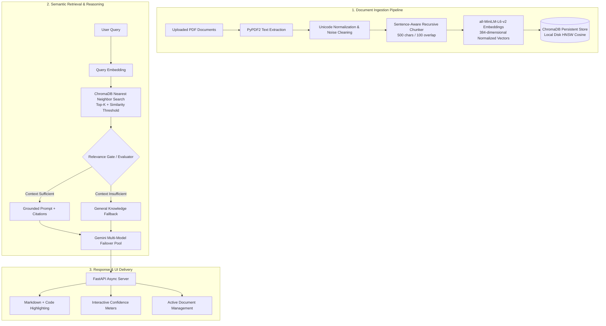

<div align="center">

# ⚡ Neural RAG: Hybrid PDF Intelligence & Search Engine

**An enterprise-grade, document-grounded Question Answering and Summarization system powered by ChromaDB, Sentence-Transformers, and Google Gemini with Multi-Model Failover.**

[](https://fastapi.tiangolo.com)
[](https://www.trychroma.com/)
[](https://ai.google.dev/)
[](https://www.python.org/)
[](LICENSE)

<br />

[Features](#-key-features) •
[Architecture](#-architecture--pipeline) •
[Quickstart](#-quickstart-guide) •
[API Reference](#-api-reference) •
[Configuration](#-configuration) •
[UI Showcase](#-user-interface)

</div>

---

## 📖 Overview

**Neural RAG** is a production-ready Retrieval-Augmented Generation (RAG) platform designed to eliminate LLM hallucinations by strictly grounding responses in source PDF documents. Featuring a **Deep Obsidian Glassmorphic** web interface, it combines local HNSW vector indexing via **ChromaDB** with sentence-aware chunking and an **adaptive multi-model failover engine** across Google's Gemini Flash family.

Whether querying multi-thousand-character technical specifications or generating global document summaries, Neural RAG provides sub-millisecond vector retrieval, transparent chunk-level provenance, real-time similarity metrics, and full document lifecycle control.

---

## ⚡ Key Features

- **🎨 Modern Obsidian Glassmorphic UI**: Single-Page Application (SPA) crafted with pure Vanilla HTML5/CSS3/JavaScript—zero heavy framework overhead, buttery smooth 60fps micro-animations, real-time Markdown rendering (`marked.js`), and code syntax highlighting (`highlight.js`).
- **🗄️ High-Performance ChromaDB Vector Store**: Fast, persistent embedding storage on local disk with cosine similarity search and MD5 content fingerprinting to avoid redundant embeddings.
- **📄 Multi-Document Lifecycle & Management**:
  - Drag-and-drop batch PDF ingestion with live progress.
  - **Individual Document Deletion (`×`)**: Purge specific documents from ChromaDB and active memory with automatic session re-indexing.
  - **Bulk Document Reset ("Clear All")**: Wipe the collection and reset state in a single click.
- **🛡️ Multi-Model Gemini LLM Engine with Auto-Failover**:
  - Automatically queries across a prioritized pool (`gemini-flash-latest`, `gemini-3.5-flash`, `gemini-3.7-flash`, `gemini-flash-lite-latest`, `gemini-2.5-flash`).
  - Gracefully recovers from HTTP 429 quota exhaustion without disrupting the user experience.
- **⚖️ Dual-Path LLM Judge & Grounding Gate**:
  - Context evaluator determines whether retrieved context is truly relevant before answering.
  - **Grounded Document Path (Emerald)**: Cites exact chunks and metadata.
  - **General Knowledge Fallback (Amber)**: Clearly alerts users when information lies outside the uploaded document.
- **📊 Real-Time Metrics & Diagnostics Accordion**:
  - Live 5-metric dashboard: File Count, Page Count, Characters, Chunks, and Average Chunk Size.
  - Expandable retrieval diagnostics displaying chunk rank, L2/Cosine distance, and color-coded confidence percentage bars.
- **📝 Executive Document Summarization**: Composite overview sampling generates comprehensive, grounded summaries across entire multi-page documents with 1 click.
- **💾 Conversation Memory & Export**: Sliding-window multi-turn memory with instant JSON transcript download.

---

## 🏗️ Architecture & Pipeline



---

## 💻 Tech Stack

| Layer | Technology | Description |
| :--- | :--- | :--- |
| **Backend Framework** | [FastAPI](https://fastapi.tiangolo.com/) + [Uvicorn](https://www.uvicorn.org/) | Asynchronous, high-throughput REST API server |
| **Vector Database** | [ChromaDB](https://www.trychroma.com/) | Persistent vector database with HNSW indexing |
| **Fallback Vector Store** | [FAISS](https://github.com/facebookresearch/faiss) | CPU-accelerated similarity search |
| **Embedding Model** | [Sentence-Transformers](https://www.sbert.net/) (`all-MiniLM-L6-v2`) | 384-d dense semantic vectors with L2 normalization |
| **Generative LLM** | [Google Gemini API](https://ai.google.dev/) | Primary: `gemini-flash-latest` with automated multi-model failover pool |
| **PDF Extraction** | [PyPDF2](https://pypdf2.readthedocs.io/) | High-fidelity text and page metadata extraction |
| **Frontend UI** | HTML5, Vanilla CSS3, JavaScript (ES6+) | Custom obsidian glassmorphism design system |
| **Client Libraries** | `marked.js`, `highlight.js` | Real-time Markdown parsing and syntax highlighting |

---

## 📂 Project Structure

```text
pdf_rag_app/
├── main.py                     # Primary one-command application launcher
├── server.py                   # Production FastAPI REST backend & static files
├── requirements.txt            # Python dependencies
├── README.md                   # Project documentation
├── ARCHITECTURE.md             # In-depth architectural specification
├── .env.example                # Environment variable configuration template
│
├── frontend/                   # Client Web Application
│   ├── index.html              # Modern semantic HTML5 markup
│   ├── style.css               # Obsidian glassmorphic design system
│   └── app.js                  # Pure JS client logic, API calls, and UI state
│
├── src/                        # Core Neural RAG Engine
│   ├── chroma_store.py         # ChromaDB persistence, querying, and deletion
│   ├── vector_store.py         # FAISS vector store and embedding generation
│   ├── chunker.py              # Sentence-aware text chunking with overlap
│   ├── pdf_processor.py        # Resilient PDF text extraction & validation
│   ├── text_cleaner.py         # Unicode NFKC cleaning & noise reduction
│   ├── retrieval.py            # Cosine semantic retrieval & LLM Judge
│   ├── memory_manager.py       # Sliding-window conversational buffer & export
│   └── config.py               # Central configuration and hyperparameters
│
├── chroma_db/                  # Local persistent ChromaDB vector storage
└── archive/                    # Historical iterations & Streamlit prototype
```

---

## 🚀 Quickstart Guide

### 1. Clone the Repository
```bash
git clone https://github.com/Nikhillokesh777/Hybrid-RAG-PDF-Chatbot.git
cd Hybrid-RAG-PDF-Chatbot
```

### 2. Create and Activate Virtual Environment
```bash
# Windows
python -m venv venv
.\venv\Scripts\activate

# macOS / Linux
python3 -m venv venv
source venv/bin/activate
```

### 3. Install Dependencies
```bash
pip install -r requirements.txt
```

### 4. Configure Your API Key
Copy the example environment file and add your Google Gemini API key:
```bash
copy .env.example .env     # Windows
cp .env.example .env       # macOS / Linux
```

Edit `.env`:
```env
GOOGLE_API_KEY=AIzaSy...your_gemini_api_key_here
GEMINI_MODEL=models/gemini-flash-latest
```
> [!TIP]
> Get a free API key at [Google AI Studio](https://aistudio.google.com/).

### 5. Launch the Application
Run the launcher:
```bash
python main.py
```
Or start Uvicorn directly:
```bash
uvicorn server:app --host 127.0.0.1 --port 8000
```

Open your browser at:
- **Web Application**: [http://127.0.0.1:8000](http://127.0.0.1:8000)
- **Interactive Swagger Documentation**: [http://127.0.0.1:8000/docs](http://127.0.0.1:8000/docs)
- **ReDoc Alternate API Docs**: [http://127.0.0.1:8000/redoc](http://127.0.0.1:8000/redoc)

---

## 📡 API Reference

The FastAPI backend exposes standard RESTful endpoints for seamless headless integration:

| Method | Endpoint | Description |
| :--- | :--- | :--- |
| `GET` | `/` | Serves the single-page web interface. |
| `GET` | `/api/status` | Returns system readiness, model name, active documents, and ChromaDB vector count. |
| `POST` | `/api/upload` | Upload one or multiple PDF documents (`multipart/form-data`) for chunking and ChromaDB indexing. |
| `POST` | `/api/query` | Execute semantic search, retrieval validation, and Gemini answer generation. |
| `DELETE`| `/api/documents/{doc_name}` | Purge a specific document and its chunks from ChromaDB and session memory. |
| `DELETE`| `/api/documents` | Clear all documents, wipe the ChromaDB collection, and reset session state. |
| `GET` | `/api/history` | Retrieve the active conversation transcript. |
| `DELETE`| `/api/history` | Clear conversational chat memory. |

### Query Request Payload (`POST /api/query`)
```json
{
  "question": "What are the primary findings in section 3?",
  "top_k": 5,
  "similarity_threshold": 0.85
}
```

### Query Response Payload
```json
{
  "answer": "According to Section 3, the key findings demonstrate...",
  "source_type": "document",
  "citations": [
    {
      "chunk_id": 2,
      "page_estimate": 3,
      "preview": "Section 3: Key Experimental Results...",
      "distance": 0.42
    }
  ],
  "retrieved_chunks": [
    {
      "rank": 1,
      "preview": "Section 3: Key Experimental Results...",
      "distance": 0.42,
      "passed_threshold": true
    }
  ]
}
```

---

## ⚙️ Configuration & Hyperparameters

Tune the RAG engine behavior via `src/config.py` or `.env`:

| Variable | Default | Description |
| :--- | :--- | :--- |
| `GOOGLE_API_KEY` | — | Google Gemini API authentication key |
| `GEMINI_MODEL` | `models/gemini-flash-latest` | Primary generative LLM model |
| `CHROMA_DB_DIR` | `./chroma_db` | Persistent disk directory for ChromaDB vectors |
| `DEFAULT_CHUNK_SIZE` | `500` | Target characters per chunk |
| `DEFAULT_CHUNK_OVERLAP`| `100` | Overlapping characters between consecutive chunks |
| `DEFAULT_TOP_K` | `5` | Number of chunks retrieved per query |
| `DEFAULT_SIMILARITY_THRESHOLD` | `0.85` | Cutoff distance for chunk relevance gate |
| `GEMINI_ANSWER_TEMPERATURE` | `0.2` | Generation temperature for grounded responses |
| `GEMINI_ANSWER_MAX_TOKENS` | `1024` | Maximum tokens per response |

---

## 🖥️ User Interface

### Obsidian Glassmorphic Theme
- **Dynamic Control Panel**: Sliders for Top-$K$ chunks ($1$ to $10$) and Sensitivity Threshold with a real-time sensitivity scale guide.
- **Active Document Chips**: Filename truncation, page counts, and instant deletion (`×`).
- **One-Click Quick Inquiries**: Executive Summary, Key Findings, and Data Point extraction.
- **Provenance Badges**:
  - `DOCUMENT GROUNDED`: Green badge with citation cards.
  - `GENERAL KNOWLEDGE`: Amber alert indicating queries outside uploaded documents.

---

## 🛡️ License

Distributed under the **MIT License**. See [`LICENSE`](LICENSE) for more information.

---

<div align="center">
  <sub>Built with ❤️ by Nikhil Lokesh · Powered by ChromaDB & Google Gemini</sub>
</div>
